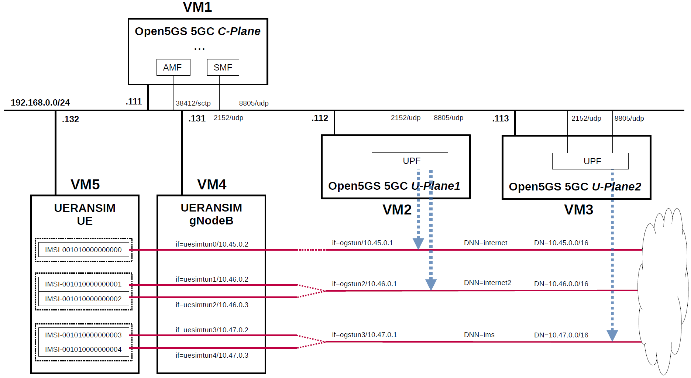

# 5G SA Network Access & Data Forwarding Simulation Based on Open5GS

This project builds a software-based **5G Standalone (5G SA) simulation environment** using **Open5GS** and **UERANSIM**.  
The goal is to understand how a UE connects to a 5G core network, completes registration, establishes a PDU Session, receives an IP address, and forwards user-plane traffic through the selected UPF and DNN.

## Project Overview

In this project, I deployed a multi-VM 5G SA simulation environment:

- **VM1**: Open5GS 5GC Control Plane, including AMF and SMF
- **VM2**: Open5GS 5GC User Plane 1, serving `internet` and `internet2`
- **VM3**: Open5GS 5GC User Plane 2, serving `ims`
- **VM4**: UERANSIM gNodeB
- **VM5**: UERANSIM UE

The main focus of this project is not only to run Open5GS and UERANSIM, but also to verify how the control plane and user plane work together in a 5G SA network.



## Why I Built This Project

When studying 5G only from theory, concepts such as UE, gNodeB, AMF, SMF, UPF, DNN and PDU Session can feel isolated.  
This project helped me connect these concepts into a working system.

The project focuses on three questions:

1. How does a UE register to a 5G Core through a gNodeB?
2. How does the core network establish a PDU Session and assign an IP address?
3. How does the user-plane traffic follow the correct DNN and UPF path?

## Network Topology

| VM | Role | IP Address | Main Function |
|---|---|---|---|
| VM1 | Open5GS 5GC C-Plane | `192.168.0.111/24` | AMF, SMF and other control-plane functions |
| VM2 | Open5GS 5GC U-Plane1 | `192.168.0.112/24` | UPF for `internet` and `internet2` |
| VM3 | Open5GS 5GC U-Plane2 | `192.168.0.113/24` | UPF for `ims` |
| VM4 | UERANSIM gNodeB | `192.168.0.131/24` | Simulated 5G base station |
| VM5 | UERANSIM UE | `192.168.0.132/24` | Simulated 5G user equipment |

## Subscriber and DNN Mapping

| UE | IMSI | DNN | UE Tunnel Interface | UE IP Address | User Plane |
|---|---|---|---|---|---|
| UE0 | `001010000000000` | `internet` | `uesimtun0` | `10.45.0.2` | UPF1 |
| UE1 | `001010000000001` | `internet2` | `uesimtun1` | `10.46.0.2` | UPF1 |
| UE2 | `001010000000002` | `internet2` | `uesimtun2` | `10.46.0.3` | UPF1 |
| UE3 | `001010000000003` | `ims` | `uesimtun3` | `10.47.0.2` | UPF2 |
| UE4 | `001010000000004` | `ims` | `uesimtun4` | `10.47.0.3` | UPF2 |

| DNN | Data Network | UPF Tunnel Interface | User Plane |
|---|---|---|---|
| `internet` | `10.45.0.0/16` | `ogstun` | UPF1 |
| `internet2` | `10.46.0.0/16` | `ogstun2` | UPF1 |
| `ims` | `10.47.0.0/16` | `ogstun3` | UPF2 |

## Project Structure

```text
.
├── README.md
├── docs/
│   └── network-overview.png
├── configs/
│   ├── open5gs-cplane/
│   │   ├── amf.yaml.diff
│   │   ├── nrf.yaml.diff
│   │   └── smf.yaml.diff
│   ├── open5gs-uplane1/
│   │   └── upf.yaml.diff
│   ├── open5gs-uplane2/
│   │   └── upf.yaml.diff
│   ├── ueransim-ran/
│   │   └── open5gs-gnb.yaml.diff
│   └── ueransim-ue/
│       ├── open5gs-ue0.yaml.diff
│       ├── open5gs-ue1.yaml.diff
│       ├── open5gs-ue2.yaml.diff
│       ├── open5gs-ue3.yaml.diff
│       └── open5gs-ue4.yaml.diff
├── scripts/
│   ├── setup-uplane1-tunnels.sh
│   ├── setup-uplane2-tunnels.sh
│   ├── run-open5gs-cplane.sh
│   ├── run-open5gs-uplane1.sh
│   ├── run-open5gs-uplane2.sh
│   ├── start-ueransim-gnb.sh
│   ├── start-ueransim-ue0.sh
│   └── verify-ue0-path.sh
├── logs/
│   ├── ueransim-gnb-ng-setup.log
│   ├── ueransim-ue0-registration-pdu-session.log
│   ├── open5gs-cplane-ue0-registration.log
│   └── open5gs-uplane1-ue0-session.log
└── verification/
    ├── ue0-tun-interface-ip.txt
    ├── ue0-ping-google.txt
    ├── upf1-ogstun-icmp-tcpdump.txt
    ├── ue0-curl-google.txt
    └── upf1-ogstun-http-tcpdump.txt
```

## Configuration Work

### 1. Control Plane Configuration

The control plane configuration focuses on enabling the gNodeB to connect to AMF and allowing SMF to select the correct UPF according to DNN.

Key configuration changes:

- AMF listens on `192.168.0.111`
- PLMN changed to `001/01`
- SMF PFCP server listens on `192.168.0.111`
- SMF maps:
  - `internet` and `internet2` to UPF1
  - `ims` to UPF2

Relevant files:

- `configs/open5gs-cplane/amf.yaml.diff`
- `configs/open5gs-cplane/nrf.yaml.diff`
- `configs/open5gs-cplane/smf.yaml.diff`

### 2. User Plane Configuration

UPF1 is configured for two DNNs:

- `internet` → `ogstun` → `10.45.0.0/16`
- `internet2` → `ogstun2` → `10.46.0.0/16`

UPF2 is configured for one DNN:

- `ims` → `ogstun3` → `10.47.0.0/16`

Relevant files:

- `configs/open5gs-uplane1/upf.yaml.diff`
- `configs/open5gs-uplane2/upf.yaml.diff`
- `scripts/setup-uplane1-tunnels.sh`
- `scripts/setup-uplane2-tunnels.sh`

### 3. RAN and UE Configuration

The gNodeB is configured to connect to the AMF at `192.168.0.111:38412`.  
Each UE uses a different IMSI and DNN to verify whether the 5G core can select the correct user-plane path.

Relevant files:

- `configs/ueransim-ran/open5gs-gnb.yaml.diff`
- `configs/ueransim-ue/open5gs-ue0.yaml.diff`
- `configs/ueransim-ue/open5gs-ue1.yaml.diff`
- `configs/ueransim-ue/open5gs-ue2.yaml.diff`
- `configs/ueransim-ue/open5gs-ue3.yaml.diff`
- `configs/ueransim-ue/open5gs-ue4.yaml.diff`

## Running Sequence

### 1. Start Open5GS Control Plane

Run on VM1:

```bash
./scripts/run-open5gs-cplane.sh
```

### 2. Configure and Start User Plane

Run on VM2:

```bash
./scripts/setup-uplane1-tunnels.sh
./scripts/run-open5gs-uplane1.sh
```

Run on VM3:

```bash
./scripts/setup-uplane2-tunnels.sh
./scripts/run-open5gs-uplane2.sh
```

### 3. Start gNodeB

Run on VM4:

```bash
./scripts/start-ueransim-gnb.sh
```

Expected result:

- SCTP connection to AMF is established
- NG Setup procedure succeeds

Example logs are saved in:

- `logs/ueransim-gnb-ng-setup.log`
- `logs/open5gs-amf-gnb-ng-setup.log`

### 4. Start UE0

Run on VM5:

```bash
./scripts/start-ueransim-ue0.sh
```

Expected result:

- UE completes PLMN search
- RRC connection is established
- Initial Registration succeeds
- PDU Session is established
- `uesimtun0` is created with IP `10.45.0.2`

Example logs are saved in:

- `logs/ueransim-ue0-registration-pdu-session.log`
- `logs/open5gs-cplane-ue0-registration.log`
- `logs/open5gs-uplane1-ue0-session.log`

## Verification

### UE0 PDU Session

UE0 successfully establishes a PDU Session and receives:

```text
TUN interface: uesimtun0
UE IP address: 10.45.0.2
DNN: internet
UPF: UPF1
DN interface: ogstun
```

### Ping Test

UE0 can reach the external network through `uesimtun0`:

```bash
ping google.com -I uesimtun0 -n
```

Observed RTT examples:

```text
24.8 ms
29.5 ms
20.8 ms
```

### UPF Path Verification

At the same time, packets are captured on UPF1:

```bash
tcpdump -i ogstun -n
```

The captured packets show that ICMP request and reply traffic flows through `ogstun`, proving that UE0 traffic is forwarded through the correct UPF and DNN path.

## Key Results

This project verifies the following 5G SA procedures:

1. gNodeB successfully connects to AMF through NGAP/SCTP.
2. UE successfully completes registration and authentication.
3. UE establishes a PDU Session.
4. The SMF selects the corresponding UPF based on the requested DNN.
5. UE0 receives IP `10.45.0.2` and creates `uesimtun0`.
6. UE0 traffic is forwarded through UPF1 `ogstun`.
7. End-to-end external network access is confirmed by `ping` and `tcpdump`.

## What I Learned

Through this project, I gained a clearer understanding of how a 5G SA network works from UE access to user-plane forwarding.  
I learned that a successful UE registration does not automatically prove that the user-plane path is correct. Therefore, I used log analysis, IP assignment checks, ping tests and tcpdump captures to verify the complete path.

This project helped me understand:

- how AMF and SMF manage access and session control
- how DNN affects UPF selection
- how PDU Session establishment creates UE tunnel interfaces
- how user-plane traffic is actually forwarded through GTP-U and UPF
- how to verify a 5G network using logs and packet capture

## References

- Open5GS: https://github.com/open5gs/open5gs
- UERANSIM: https://github.com/aligungr/UERANSIM
- Original sample configuration reference: https://github.com/s5uishida/open5gs_5gc_ueransim_sample_config
